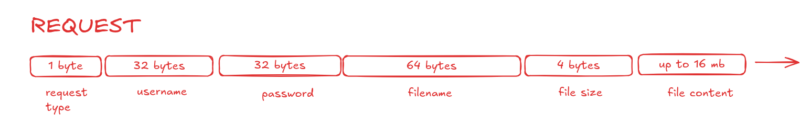
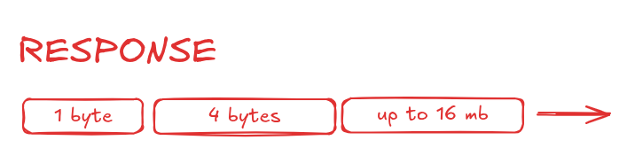

# Simple Secure File Transfer - SSFT

This protocol aims for a simple way to transfer files between client and server with easy authentication features. This is really NOT 100% secure and production ready, since features such as encryption and compression are not yet implemented. 

This protocol does not support folders. Maybe someday.

---

The protocol works in the request/response model, with predefined request types and response status, much like HTTP. The list of request types is listed below: 

### 0 AUTHENTICATE
This is required in other to store your credentials in the server and allow subsequent requests to be made. How the server stores the credentials is implementation specific. 

### 1 UPLOAD 
Sends a file content, along with the filesize.

### 2 DOWNLOAD 
Sends the file name, and if it exists and the user is authenticated, the server sends back the file content with its size.

### 3 LIST
If authenticated, sends the file names along with the number of files stored by the user. 

---

The response status are listed below. Notice that every non-zero status is an error, and must be handled accordingly. 

### 0 SUCCESS 
Everything worked as expected.

### 1 UNAUTHORIZED 
Either the username provided refers to an unexisting user or the credentials are incorrect. 

### 2 FILE_SIZE 
The file exceeds the maximum file size. Implementation specific. Notice that the absolute maximun file size an application can choose is bound to the file size field, which is 4 bytes.  

### 3 SERVER_SIDE_ERROR 
Something went wrong in the server side. There's nothing you can do.

### 4 BAD_REQUEST
Problably due to bad framing. See about it below.

### 5 FILE_NOT_FOUND
Requested file doesn't exist.

---

## Framing 

### Request

### Response

